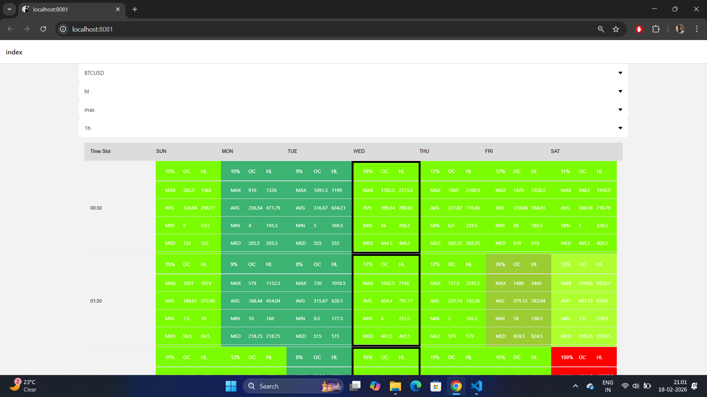
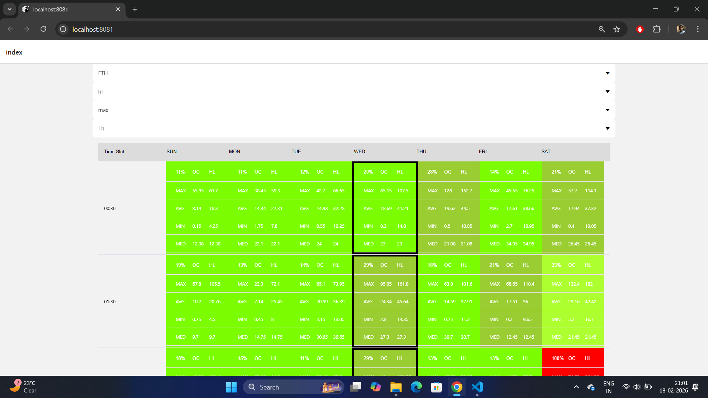
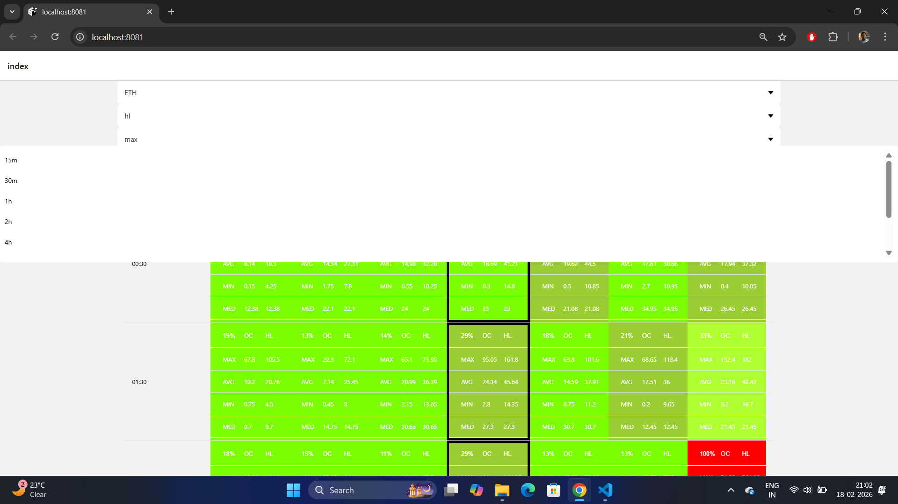
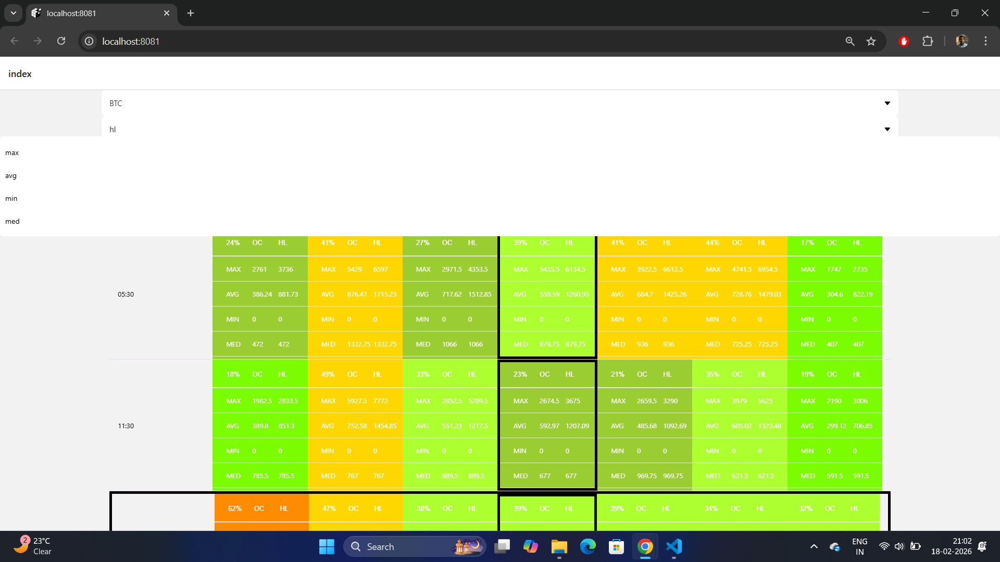

# BTC-ETH-statistical-analysis-tool
This application is created using React Native and can be used for statistical analysis of Bitcoin and Etherium. It displays time series data in a heatmap

# Objective / Concept
It is found from the analysis that BTC and ETH follows some common patterns throughout the week, as an example market remains cool on weekend but a high volatile on Monday and Friday. So we need an application which will collect sample of atleast 1 year data and from that data it gives a prediction of usual market volatility of each day of the week.

# About the application
- This application/tool fetches time series data of last 1 year (for BTC or ETH) with provided time frame (15m, 30m, 1h, 2h, 4h, 6h, 12h, 1d). 
- Then it calculates two time series data each for difference/split between Open-Closed or High-Low of that specified time frame.
- Then it divided the data for 7 days each.
- We can see Max, Average, Min, and Median of split for the specific day of the week against the timeframe
- The result data is printed in a table with day of week in row and timeframe as column
- Additionally it gives a heatmap presentation of the tabular data where green represent least volatile and red represent most volatile. Heatmap can be configured to calculate based on either max, avg, min, med value of the split (default is max).

# Demo Image

BTC heatmap

ETH heatmap

timeframe (15m, 30m, 1h, 2h, 4h, 6h, 12h, 1d)

Heatmap can be calculated based on (max, avg, min and median)

# Install Dependencies
use npm install to install all dependencies.

# Startup
To start the application run npm start or expo start

# Backend Integration
We are using Delta exchange api to collect data.